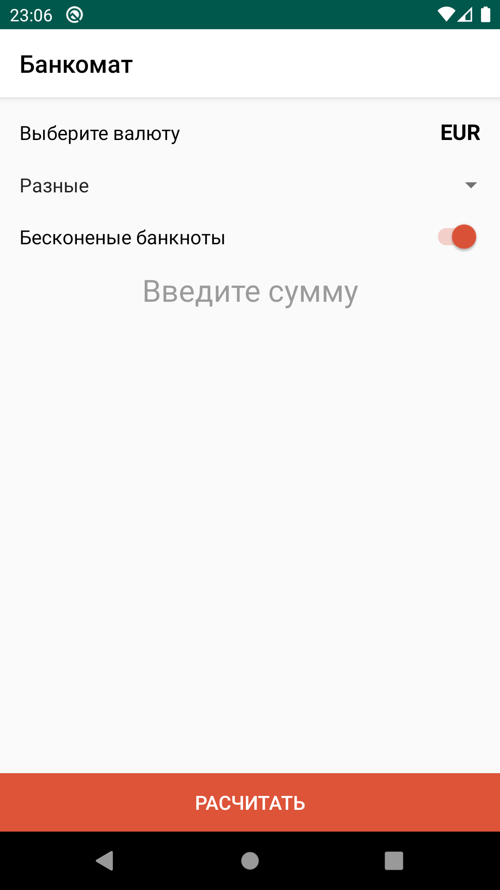
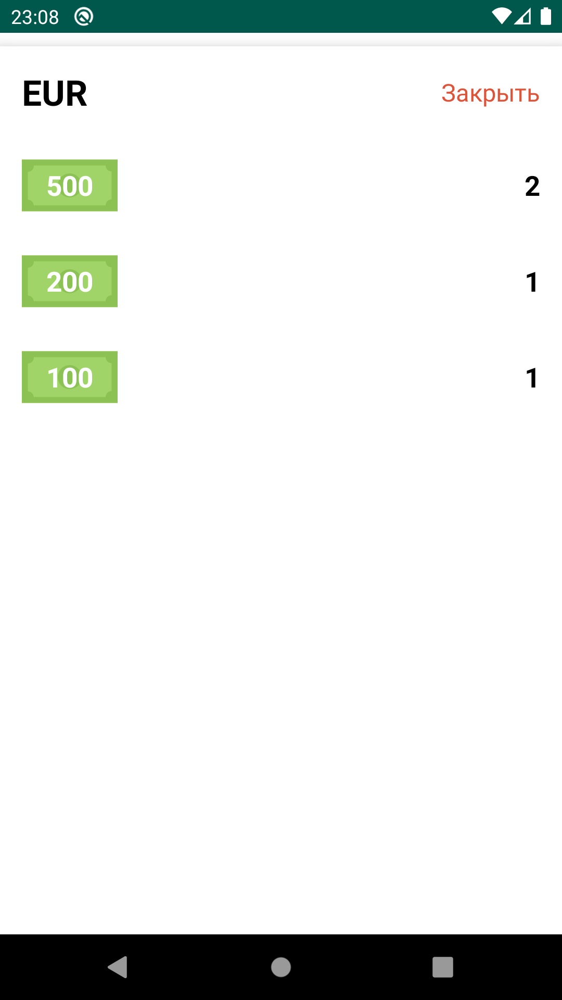
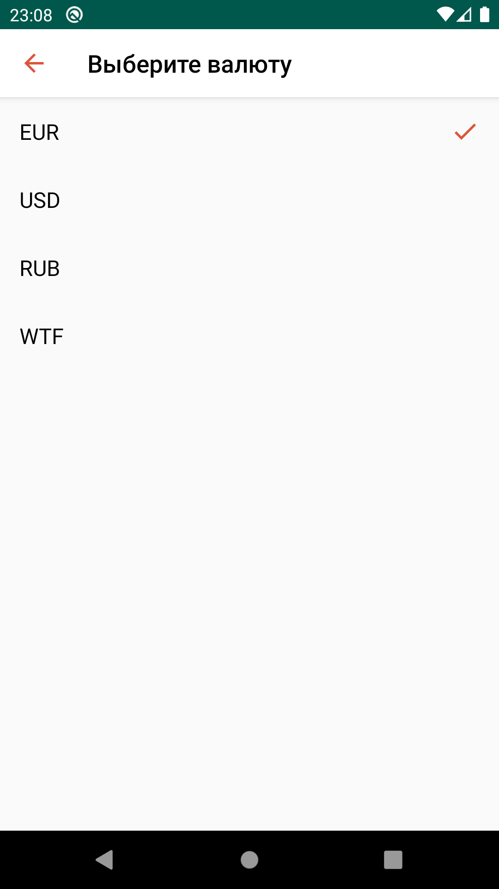

# MELScienceDemo
   

При разработки использовались фреймворки:
- Conductor
- Koin
- Moxy
- RxJava
- Gson

Приложение поддерживает вертикальную и горизонтальную ориентации. Поддерживает русский и английский языки.  
Написаны unit тесты для некоторых классов.
